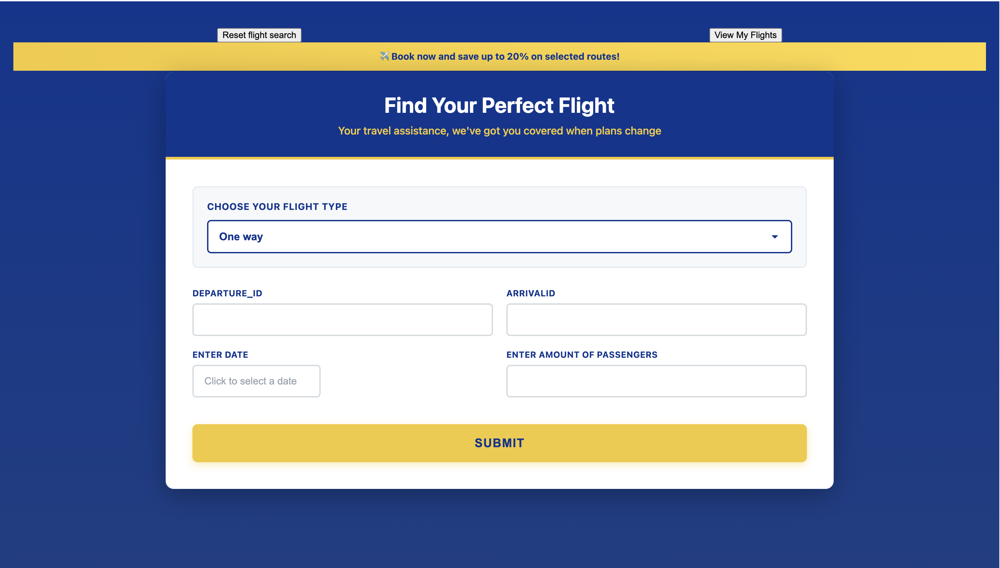

# Travel assistant system

## Project Overview

This project focuses on implementing CRUD operations (Create, Read, Update, Delete) using a client–server architecture and simulates a low-cost flight booking platform (inspired by RyanAir).




## Architecture


### Frontend

- Built with React and TypeScript

- Axios

- React Router for navigation

- React Hook Form for form handling

### Backend

- Built with Flask

- Flask-SQLAlchemy

### Data Storage

- SQLite


### Technologies Used

- TypeScript

- React

- Flask

- Axios

- SQLite

- Unit tests with PyTest


## How to Run the Project

1. Clone the repository

```
    git clone https://github.com/Sucodes/travel-assistant.git

    cd travel-assistant
```

2. Instructions on how you can run the Flask backend can be found [here](backend/README.md)


3. Instructions on how you can run the React frontend can be found [here](frontend/README.md)


4. You can interact with the API through the frontend application via the browser [here](https://travel-assistant-frontend-5nam.onrender.com)


## Some resources used are highlighted below and mentioned in commit messages/comments

- [Flask Documentation](https://flask.palletsprojects.com/)
- [Python Dotenv Documentation](https://pypi.org/project/python-dotenv/)
- [Mastering Restful Api Testing with PyTest](https://laerciosantanna.medium.com/mastering-restful-api-testing-with-pytest-56d22460a9c4)
- [PyTest Documentation](https://docs.pytest.org/en/stable/)
- [Rapid Api Documentation](https://rapidapi.com/DataCrawler/api/google-flights2/playground/apiendpoint_61db6b6b-2099-4c47-8ee5-8a8088f4a1f9)
- [React Router Documentation](https://reactrouter.com/)
- [React Hook Form Documentation](https://react-hook-form.com/)
- [Render Documentation](https://render.com/)
- [SQLAlchemy Documentation](https://docs.sqlalchemy.org/en/20/)
- [Designing RESTful APIs Udacity course](https://www.udacity.com/enrollment/ud388)
- [Claude AI](https://claude.ai/new)
